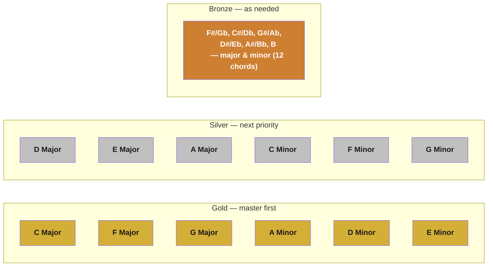

# Gold, Silver & Bronze Chords

A **practice-priority system** for the 24 possible major/minor [[Chord|triads]]: instead of drilling all 12 keys equally, learn them in three tiers — **Gold** (master first), **Silver** (learn next), **Bronze** (learn only when a specific song needs it) — ranked by how often each chord's key actually shows up in real songs.

> [!info] Source
> This framework comes from the **Become a Piano Superhuman** course (the "Ultimate Chords Cheat Sheet"). It isn't something this vault's main [[PIX Series - Course Overview|PIX Series course]] teaches — added as a supplementary practice-priority reference after the user asked about it.

## Is "84% of songs from 20% of chords" actually true?

**Short answer: the strategy is sound, but treat the exact "84%" figure as the course's own marketing framing, not an independently verified statistic.**

I couldn't find that specific number published anywhere with a stated methodology — it appears to originate from the Become a Piano Superhuman course itself, and I have no way to check how they calculated it. That said, the *underlying principle* — a small number of keys account for a hugely disproportionate share of popular music — is real and backed by actual data:

- **Spotify analyzed over 30 million songs** and found the top 4 keys — **G, C, D, and A major** — account for roughly **33% of all songs** on the platform. G major alone is ~10.7%, C major ~10.2%.
- **C major is disproportionately common** because it's the only key with zero sharps/flats — the easiest key to compose in on a piano.
- **Keys cluster around C on the circle of fifths** in real usage: after the top 4, popularity drops off steadily as key signatures pick up more sharps/flats, which is *exactly* the logic the Gold → Silver → Bronze tiers are built on.
- The general "a handful of chords/progressions cover most hit songs" idea is well documented elsewhere too — e.g. Hooktheory's analysis of 1,300 popular songs, and the viral **I–V–vi–IV** ("4 Chords") progression that alone underlies a very large share of pop radio.

So: **don't repeat "84%" as a verified fact**, but the prioritization strategy itself — learn C/F/G and their closest relative minors first, because that's genuinely where most songs live — is legitimate and matches real research, not just marketing.

## How the tiers work

Every major key has a **relative minor** (see [[Minor Scale]]) that shares the same key signature — that's why each tier pairs 3 major keys with 3 (or 6) minor keys rather than listing 12 majors then 12 minors separately. The tiers roughly track **distance from C on the circle of fifths** (fewer sharps/flats = higher tier), which lines up with why those keys are also just easier to play — see [[Remembering Major Scales]] for the same circle-of-fifths logic applied to scales.

Each chord diagram below follows this vault's usual [[Root Note|keyboard-diagram]] convention: badges mark **R** (root, green), **3** (third), and **5** (fifth) — see [[Chord]] for what those three notes are and why the 3rd is the only thing that changes between a major and minor version of the same chord.

## Gold Chords — master these first

The three all-white-key majors plus their three closest minors. If you only ever learn six chords, these are the ones — see [[Remembering Chord Fingering]] for why C, F, and G's `1-3-5` hand shape is worth over-learning before anything else.

**C Major**

![[Assets/Glossary/chord-c-major.svg]]

Songs: "Let It Be" (The Beatles), "Dreams" (Fleetwood Mac), "Hello" (Lionel Richie).

**F Major**

![[Assets/Glossary/chord-f-major.svg]]

Songs: "Do You Remember" (Phil Collins), "Stuck on You" (Lionel Richie).

**G Major**

![[Assets/Glossary/chord-g-major.svg]]

Songs: "Knockin' on Heaven's Door" (Bob Dylan).

**A Minor** *(relative minor of C major — same key signature, no sharps/flats)*

![[Assets/Glossary/chord-a-minor.svg]]

Songs: "Stairway to Heaven" (Led Zeppelin), "Creep" (Radiohead), "Hallelujah" (Leonard Cohen).

**D Minor** *(relative minor of F major)*

![[Assets/Glossary/chord-d-minor.svg]]

Used constantly across rock/classical (Pink Floyd, Led Zeppelin, and The Rolling Stones all lean on it), though it's harder to pin one single iconic example — verify a specific song's key before citing it as a D minor showpiece.

**E Minor** *(relative minor of G major)*

![[Assets/Glossary/chord-e-minor.svg]]

Songs: "Livin' on a Prayer" (Bon Jovi), "Take Me to Church" (Hozier), "Nothing Else Matters" (Metallica, intro).

## Silver Chords — next priority

One extra sharp each over Gold — genuinely common, just not *as* dominant.

**D Major**

![[Assets/Glossary/chord-d-major.svg]]

Songs: "Can't Help Falling in Love" (UB40's version, capo-free in D).

**E Major**

![[Assets/Glossary/chord-e-major.svg]]

Songs: "Don't Stop Believin'" (Journey), "Sweet Home Alabama" (Lynyrd Skynyrd), "Photograph" (Ed Sheeran).

**A Major**

![[Assets/Glossary/chord-a-major.svg]]

Songs: "Take Me Home, Country Roads" (John Denver).

**C Minor** *(relative minor of D#/Eb major)*

![[Assets/Glossary/chord-c-minor.svg]]

Less common in mainstream pop than the majors above — shows up more in classical/film scoring (Beethoven famously favored C minor for his most dramatic works) than in radio hits.

**F Minor** *(relative minor of G#/Ab major)*

![[Assets/Glossary/chord-f-minor.svg]]

Same pattern as C minor — present, but no single ubiquitous pop example worth over-claiming here.

**G Minor** *(relative minor of A#/Bb major)*

![[Assets/Glossary/chord-g-minor.svg]]

Mozart's go-to key for musical tragedy, historically — again, more a classical-key association than a pop-radio one.

## Bronze Chords — learn only when a song needs it

The remaining 12 keys (6 roots × major/minor), each carrying 4+ sharps or flats. Genuinely rare in mainstream pop — that rarity is *why* they're bronze, not a gap in this list. Shown here with both spellings since this vault otherwise uses [[Sharps & Flats|sharp-only notation]], because Bronze-tier keys are exactly where you're most likely to see the flat spelling in outside sheet music.

| Major | | Minor | |
|---|---|---|---|
| D#/Eb Major | ![[Assets/Glossary/chord-d-sharp-major.svg]] | D#/Eb Minor | ![[Assets/Glossary/chord-d-sharp-minor.svg]] |
| G#/Ab Major | ![[Assets/Glossary/chord-g-sharp-major.svg]] | G#/Ab Minor | ![[Assets/Glossary/chord-g-sharp-minor.svg]] |
| B Major | ![[Assets/Glossary/chord-b-major.svg]] | B Minor | ![[Assets/Glossary/chord-b-minor.svg]] |
| F#/Gb Major | ![[Assets/Glossary/chord-f-sharp-major.svg]] | F#/Gb Minor | ![[Assets/Glossary/chord-f-sharp-minor.svg]] |
| C#/Db Major | ![[Assets/Glossary/chord-c-sharp-major.svg]] | C#/Db Minor | ![[Assets/Glossary/chord-c-sharp-minor.svg]] |
| A#/Bb Major | ![[Assets/Glossary/chord-a-sharp-major.svg]] | A#/Bb Minor | ![[Assets/Glossary/chord-a-sharp-minor.svg]] |

Two real exceptions worth knowing, precisely *because* they're exceptions:
- **A#/Bb Major** — "Purple Rain" (Prince). Bb major is actually the most common Bronze-tier key in practice (8th most popular major key overall), so it's the one worth learning first if you're moving into this tier.
- **B Minor** — "Hotel California" (Eagles).

## Practice approach

1. **Don't skip straight to Bronze** because a favorite song needs it — learn the Gold six solidly first. The `1-3-5` hand shape from [[Remembering Chord Fingering]] is the same shape everywhere; Gold is where it becomes automatic.
2. **Learn each tier's chords in major/minor pairs**, not all-majors-then-all-minors — C major → A minor, F major → D minor, G major → E minor. Per [[Chord]], only the middle finger's target changes between them, so pairing reinforces that shortcut instead of treating 24 chords as 24 unrelated shapes.
3. **Use Gold + Silver together for real songs before touching Bronze.** Nine of the twelve Gold/Silver chords (C, F, G, D, E, A major and their relative minors) already cover the large majority of simple pop/rock chord charts — see [[Lesson 05 - Chords]] for this course's own chord-based songs.
4. **Treat Bronze as "look it up when you need it,"** not something to drill in advance — that's the entire point of ranking it last.

> [!info] Sources consulted
> - [Digital Trends / Gizmodo — Spotify's analysis of the most popular musical keys](https://gizmodo.com/a-chart-of-the-most-commonly-used-keys-shows-our-actual-1703086174)
> - [Hooktheory Blog — I analyzed the chords of 1,300 popular songs for patterns](https://www.hooktheory.com/blog/i-analyzed-the-chords-of-1300-popular-songs-for-patterns-this-is-what-i-found/)
> - ["Ultimate Chords Cheat Sheet" (Become a Piano Superhuman)](https://www.scribd.com/document/715553234/Ultimate-Chords-Cheat-Sheet) — origin of the Gold/Silver/Bronze framework
> - Individual song-key verifications via [Hooktheory TheoryTab](https://www.hooktheory.com/theorytab), [SongKeyFinder](https://www.songkeyfinder.com/), and [GetSongKey](https://getsongkey.com/) (cited inline per song above)

## Used in
- [[Chord]]
- [[Remembering Chord Fingering]]
- [[Major Scale]]
- [[Minor Scale]]
- [[Remembering Major Scales]]
- [[Lesson 05 - Chords]]
