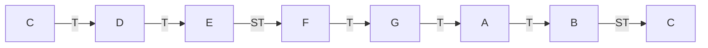

# Major Scale

> [!info] At a glance — Major vs [[Minor Scale]]
> | Degree | 1 | 2 | 3 | 4 | 5 | 6 | 7 | 8 |
> |---|---|---|---|---|---|---|---|---|
> | Major step | – | T | **T** | **ST** | T | **T** | T | **ST** |
> | Minor step | – | T | **ST** | **T** | T | **ST** | T | **T** |
>
> Bold = where they differ. Everywhere else, major and minor step identically.

A **major scale** is 8 notes, picked from the 12 keys in an [[Octave]], using one fixed pattern of whole steps and half steps (see [[Sharps & Flats]] for what those mean). That pattern is:

**T T ST T T T ST**
(Whole – Whole – Half – Whole – Whole – Whole – Half)

This single formula is what makes a scale sound "major" (bright, resolved — the classic Do-Re-Mi-Fa-Sol-La-Ti-Do sound, same as [[Sargam]]'s Sa Re Ga Ma Pa Dha Ni Sa) — no matter which of the 12 keys it starts from. Apply the same 7-step pattern from any starting note and you get *that* note's major scale.

> [!info] Abbreviations used in this course
> - **T** = Tone / whole step — skip one key (e.g. C → D)
> - **ST** = Semitone / half step — the very next key (e.g. C → C#)
>
> Same meaning as "whole step" / "half step" in [[Sharps & Flats]] — just PIX Series' shorthand for it.

## Worked example: C Major
C major is the clearest way to see the formula, since it lands only on white keys — no sharps or flats needed at all:

![[major-scale-degrees.svg]]

## Scale degrees
Each note in the scale has a position number (and a formal name, rarely used by beginners but good to recognize):

| Degree | 1 | 2 | 3 | 4 | 5 | 6 | 7 | 8 |
|--------|---|---|---|---|---|---|---|---|
| C major note | C | D | E | F | G | A | B | C |
| Name | Tonic | Supertonic | Mediant | Subdominant | Dominant | Submediant | Leading Tone | Tonic |

Degree 1 (**tonic**) is the [[Root Note]] — the "home" note the scale is named after and built from.

## Why some scales need sharps or flats
The T-T-ST-T-T-T-ST pattern is fixed — so starting from a different note forces different keys into the scale to keep that exact shape. Take **G major**:

![[keyboard-g-major.svg]]

Degrees 1–6 (G A B C D E) are all plain white keys. But degree 7 needs to be a **half step** below the octave (G) — and the white key F is a *whole* step below G, not a half step. The only key a half step below G is the black key **F#**. So G major *must* use F#, not F, or the formula breaks. This is exactly why almost every major scale except C ends up with one or more sharps/flats — they're not arbitrary, they're forced by the formula.

## Not the same as minor
A **minor scale** uses a different pattern of whole/half steps starting from the same kind of formula idea, which gives it a darker/sadder sound instead of major's bright one. Covered separately once that lesson comes up — see [[Lesson 03 - Major Scales]]'s course for where it fits in.

## Used in
- [[Lesson 03 - Major Scales]]
- [[Sharps & Flats]]
- [[Sargam]]
- [[Root Note]]
- [[Remembering Major Scales]]
