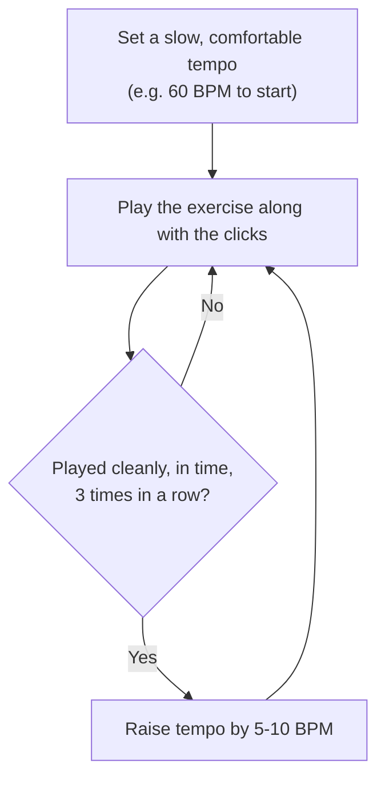

# Metronome

A **metronome** is a tool that produces a steady, repeating click (or beep, or flash) at a set speed. You play along with it to practice keeping perfectly even timing — without one, it's very easy to speed up or slow down without noticing.

## BPM (Beats Per Minute)
Metronome speed is measured in **BPM**: how many clicks happen in one minute. 60 BPM = one click per second. Higher BPM = faster.

## Why it matters for these exercises
[[Alankar]]s and the [[Lesson 02 - Western Notes & Right Hand Exercises|right-hand exercises]] are built on repeating a pattern evenly. Playing the right notes isn't the whole exercise — playing them **in even time** is, and a metronome is what actually proves whether that's happening, since the ear alone tends not to notice small drifts in tempo.

## The standard practice loop
Start slower than feels necessary. Only speed up once it's clean.

## Where to get one
- Many keyboards/pianos have a built-in metronome.
- A free phone app or browser metronome ("online metronome") works just as well — no need to buy a physical one to start.

## Used in
- [[Alankar]]
- [[Lesson 01 - Basics of Piano & Alankars]]
- [[Lesson 02 - Western Notes & Right Hand Exercises]]
