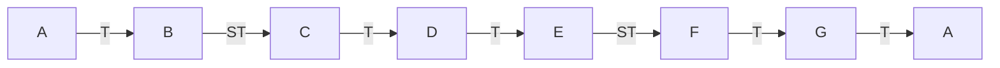

# Minor Scale

> [!info] At a glance — Minor vs [[Major Scale]]
> | Degree | 1 | 2 | 3 | 4 | 5 | 6 | 7 | 8 |
> |---|---|---|---|---|---|---|---|---|
> | Minor step | – | T | **ST** | **T** | T | **ST** | T | **T** |
> | Major step | – | T | **T** | **ST** | T | **T** | T | **ST** |
>
> Bold = where they differ. Everywhere else, major and minor step identically.

A **minor scale** (natural minor) is the other half of the [[Major Scale]] picture — same idea (8 notes, a fixed pattern of [[Sharps & Flats|whole/half steps]]), but a different pattern, giving it a darker/sadder sound instead of major's bright one:

**T ST T T ST T T**
(Whole – Half – Whole – Whole – Half – Whole – Whole)

Compare to major's **T T ST T T T ST** — the half steps land in different spots (2nd-3rd and 5th-6th instead of 3rd-4th and 7th-8th), and that shift is the entire difference between "sounds major" and "sounds minor."

## Relative minor
A minor uses **A B C D E F G** — the exact same 7 notes as C major, just starting from a different [[Root Note]]. Every major scale has a matching **relative minor** that shares its notes: start on the major scale's 6th degree and you land on its relative minor's root. This is why A minor needs no sharps/flats at all, same as C major.

## Used in
- [[Lesson 04 - Minor Scales]]
- [[Major Scale]]
- [[Sharps & Flats]]
