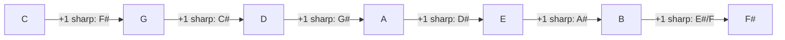
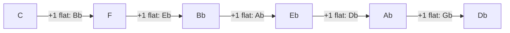

# Remembering Major Scales

General memory tricks for the 12 [[Major Scale]]s — standard ways pianists learn to recall them, not specific to any one video.

## 1. Anchor on C Major first
C major uses zero sharps/flats — pure white keys. Get it solid first; every other major scale is just "C major's shape, moved to start on a different key."

## 2. One fingering covers half the scales for free
C, G, D, A, E, B all share the exact same right-hand fingering: `1 2 3 1 2 3 4 5`. Learn that pattern once (see [[Lesson 03 - Major Scales]]) and it's already correct for 6 of the 12 scales — only the notes change, not the finger movements.

## 3. The Circle of Fifths — predicts which sharps/flats come next
Moving up a fifth each time adds exactly **one new sharp** — always becoming the new 7th degree:

Moving down a fifth (up a fourth) each time adds exactly **one new flat** — always becoming the new 4th degree:

You don't need to memorize each scale's full note list from scratch — just memorize *the order sharps/flats get added in*, and count how many the scale needs.

## 4. Standard mnemonics for that order
- **Sharps** are always added in this order: `F# C# G# D# A# E# B#` — mnemonic: *"Father Charles Goes Down And Ends Battle."*
- **Flats** are always added in the exact reverse order: `Bb Eb Ab Db Gb Cb Fb` — mnemonic: *"Battle Ends And Down Goes Charles' Father."*

However many sharps or flats a scale has, they're always the first N notes off these two lists — never a random pick.

## 5. Say the formula, don't just play it
Chant **"Tone – Tone – Semi – Tone – Tone – Tone – Semi"** out loud while playing (see [[Major Scale]]). Hearing/saying the pattern builds memory the same way playing it does, and it makes wrong notes easier to catch by ear.

## 6. Group by "how many black keys"
[[Lesson 03 - Major Scales]] already splits the 12 scales into two groups by fingering, and that split doubles as a memory aid: C, G, D, A, E, B barely touch black keys; F#, F, Bb, Eb, Ab, Db lean on them more. Learn one group solidly before starting the other, rather than all 12 at once.

## Used in
- [[Major Scale]]
- [[Lesson 03 - Major Scales]]
